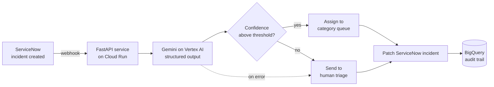

# Help Desk Ticket Router

An AI service that reads incoming IT support tickets, classifies them with Gemini on Google Vertex AI, and routes them to the right ServiceNow queue. Low-confidence tickets go to a human triage queue instead of being auto-assigned, and every decision is logged to BigQuery for audit and accuracy measurement.

It started as a single classification notebook and was rebuilt into a deployable, tested Cloud Run service: one structured model call, a routing layer, a safe rollout path, and the operational pieces a real help desk needs.

## What it does

When a ticket comes in, a single Gemini call returns a category, a confidence score, tags, a priority, an ETA, and a draft reply, all validated against a fixed schema. The routing layer maps the category to a ServiceNow assignment group and the priority to impact and urgency, then writes the result back to the incident. If the model is not confident, or if the call fails, the ticket is sent to a human triage queue rather than guessed at or dropped.

## Engineering highlights

- **Structured model output.** One Vertex AI call with a Pydantic response schema returns all fields validated, replacing a four-call prompt chain and a brittle JSON parser. The model cannot return a shape the routing layer does not expect.
- **Safe rollout by design.** A suggest mode (the default) writes the AI recommendation as a work note without changing the assignment, so the system can run live and be measured before it is trusted to auto-route. Enforce mode is a config flag away once the accuracy data justifies it.
- **Fail-safe routing.** A model or quota failure still sends the ticket to triage with a note. No ticket is ever dropped or left unrouted.
- **Idempotency and human-override guard.** Tickets a person already owns are skipped, so the service never double-processes or overwrites manual work.
- **Confidence gating.** Low-confidence classifications are routed to humans instead of auto-assigned, with the threshold tunable from real audit data.
- **Async with retries.** Vertex and ServiceNow calls are async and retry on transient failures only (network, timeout, 5xx, rate limit), never on 4xx that would fail again.
- **PII redaction.** Optional redaction of the model prompt and, by default, of the stored audit excerpt, for a government data context.
- **Audit trail.** Every decision streams to BigQuery (best-effort, so it never blocks a ticket) for accuracy measurement and tuning.
- **Quality gates.** 51 tests at 96% coverage, type checked with mypy, linted and formatted with ruff, and a CI workflow that runs all of it on every push.

## Tech stack

Python 3.12, FastAPI, Google Vertex AI (Gemini), the Google Gen AI SDK, ServiceNow Table API, BigQuery, Cloud Run, Docker, pydantic and pydantic-settings, httpx, tenacity, pytest, ruff, mypy.

## How it works

The hard part of a router is not the model, it is everything around it. The design choices that matter:

One structured call instead of four. The original notebook ran four sequential prompts per ticket and parsed JSON by hand. Vertex AI structured output lets a single call return every field, schema-validated. Lower latency, lower cost, and no parsing failures reaching the routing logic.

Suggest before enforce. A help desk should not flip on auto-assignment based on a classifier whose accuracy nobody has measured. In suggest mode the service writes its recommendation and changes nothing, so it runs live and generates accuracy data first. The eval harness measures per-category accuracy and, more importantly, accuracy on the tickets that clear the confidence threshold. Only then does it make sense to enforce.

Never lose a ticket. Classification can fail and quota can run out. When that happens the ticket goes to a human triage queue with a clear note, which is always safer than an error that leaves it unrouted.

## Project structure

    src/ticket_router/
      config.py          typed settings, validated at startup
      logging_config.py  structured JSON logging for Cloud Run
      routing.py         categories, assignment groups, priority map, confidence gate
      schemas.py         Pydantic models, including the Vertex output schema
      classifier.py      one async Gemini call with retries
      servicenow.py      async ServiceNow Table API client with retries
      redaction.py       pattern-based PII redaction
      audit.py           best-effort BigQuery decision logging
      security.py        shared-secret check for the HTTP endpoints
      service.py         orchestration: guard, classify, route, write, audit
      main.py            FastAPI app, lifespan, middleware, endpoints
    scripts/run_local.py CLI harness against a CSV, no ServiceNow needed
    scripts/evaluate.py  accuracy eval against a labeled CSV
    servicenow/          ServiceNow Business Rule trigger template
    tests/               pytest unit and API tests (Vertex and ServiceNow mocked)
    sql/audit_table.sql  BigQuery table DDL
    Dockerfile           non-root Cloud Run image
    cloudbuild.yaml      build, push, deploy pipeline
    .github/workflows/   lint, type check, test on every push

## Quickstart

Requires Python 3.12+.

    make dev                 # pip install -e ".[dev]"
    cp .env.example .env      # fill in your values
    gcloud auth application-default login

    make check               # ruff + mypy + pytest
    make run                 # uvicorn with reload on :8000

Validate classification against a CSV without touching ServiceNow:

    python scripts/run_local.py support_ticket_data.csv

Measure accuracy on a labeled set before enabling enforce mode:

    python scripts/evaluate.py labeled_tickets.csv

Call the API:

    curl -X POST localhost:8000/route \
      -H "Content-Type: application/json" \
      -H "X-Router-Token: $WEBHOOK_TOKEN" \
      -d '{"text":"My monitor flickers then goes black after ten minutes"}'

## Stakeholder dashboard

A local web app for understanding how the model performs, built for showing to
non-technical stakeholders.

    python scripts/dashboard.py      # then open http://127.0.0.1:8000

It has a scorecard (tickets classified, match rate against human labels, average
confidence, auto-route split), a per-category accuracy breakdown, a results
table that can filter to just the disagreements, and a live simulator where you
type a ticket and watch it get classified and routed in real time. The scorecard
and table read from the predictions table, so run a batch first to populate it.
The simulator calls Vertex AI live. It binds to localhost only.

## BigQuery batch mode

As an alternative to the live ServiceNow webhook, the router can run as a batch
job straight against a BigQuery table of incidents. It reads a batch, classifies
each ticket with the same model and routing logic, and writes predictions to a
separate results table you own. The source table is only ever read.

    python scripts/run_batch.py                 # most recent 200 incidents
    python scripts/run_batch.py --limit 50       # smaller batch
    python scripts/run_batch.py --no-write       # classify and summarize, write nothing

The source and results tables are set in config (`INCIDENT_SOURCE_TABLE`,
`PREDICTIONS_TABLE`). Each prediction row carries the model's category alongside
the human-entered category, so once your `Category` enum matches the source
system's category values you get a real accuracy number. `sql/predictions_table.sql`
has the table DDL and an example accuracy query.

## Endpoints (live mode)

    GET  /healthz     liveness
    GET  /readyz      readiness
    POST /route       classify and route a ticket (create, or update if sys_id given)
    POST /sn/webhook  handle a ServiceNow Business Rule / Flow payload

## Configuration

The category taxonomy and the category to assignment-group mapping live in `src/ticket_router/routing.py`. Runtime settings (GCP project, model, ServiceNow instance, routing mode, confidence threshold, PII redaction) come from environment variables, listed in `.env.example`. `gemini-2.5-flash` is the default model; `gemini-2.5-flash-lite` is cheaper for high-volume classification once accuracy is confirmed.

## Deployment

The service deploys to Cloud Run from `cloudbuild.yaml`, with the ServiceNow password and webhook token pulled from Secret Manager and the container running as a non-root user. The audit table is created from `sql/audit_table.sql`. See `PRODUCTION_READINESS.md` for the rollout plan and the operational roadmap.

## Testing and quality

    make check    # runs all of the below

51 tests with mocked Vertex and ServiceNow clients (no live calls), 96% coverage, mypy type checking across every module, and ruff for linting and formatting. CI runs the full gate on every push.

## License

MIT. See `LICENSE`.
